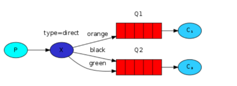
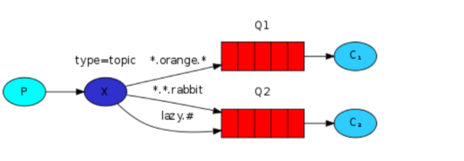

# MessageQueue

**:Contents**
* [MessageQueue 장점] 
* [RabbitMq VS Kafka 왜 rabbitmq인지]
* [RabbitMq 바인딩 방식]
* [RabbitMq를 실무에 사용하면서 더 고민할 부분]
* [왜 메세지 시스템을 도입했는지]
* [재처리 , 재처리 실패시 어떻게 했는지]
* [프로듀서 실패시 어떻게 처리하는지]
* [컨슈머 스레드는 몇개로 설정했는지] 

### MessageQueue 장점
* 애플리케이션/시스템 간의 의존성 분리 front => api 의 구조에서 대령의 요청으로 인해 api서버에 문제가 생긴다면 서비스 전체에 영향을 미친다. 
* front => mq => api 처럼 중간에 message 브로커가 있다면 대량의 요청으로 인해 mq서버에 문제가 생기더라도 서비스 전체에 영향이 미치지는 않는다.

### RabbitMq 바인딩 방식
`메시지 전달 방식` 
>> Bindings: 생성된 Exchange 에는 전달 받은 메시지를 원하는 Queue 로 전달하기 위해 Bindings 이라는 규칙을 정의할 수 있다.
* Direct Exchange
    * 메시지에 포함된 routing key 를 기반으로 Queue 에 메시지를 전달한다.
    

    
* Fanout Exchange
    * routing key 관계없이 연결된 모든 Queue에 동일한 메시지를 전달한다.
    
* Topic Exchange
    * routing key 전체가 일치 하거나 일부 패턴과 일치하는 모든 Queue 로 메시지가 전달된다.
    

    
* Headers Exchange
    * 메시지 헤더를 통해 binding key 만을 사용하는 것보다 더 다양한 속성을 사용할 수 있다.
    * Header exchange를 사용하면 binding key는 무시되고, 헤더 값이 바인딩 시 지정된 값과 같은 경우에만 일치하는 것으로 간주한다.
    
### RabbitMq를 실무에 사용하면서 더 고민할 부분
* queue에 publishing한 데이터가 정상적으로 처리되지 않았다면 확인은
    * publish confirm으로 정상저으로 전달됐는지 여부 체크후 후속(ex. 이메일 발송,에러 로그) 처리
    
* consumer에서 구독에 실패했다면 처리는 어떻게 할건지 
    * wait ,dead 큐를 만들어 재시도 횟수와 재시도 횟수를 넘어간 경우 dead큐로 넘겨 후속처리(ex. 이메일 발송,에러 로그)