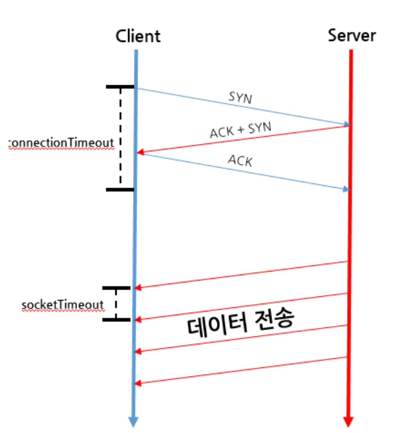

# Web

**:Contents**
* [connection]
* [3-way-HandShake]

### connection timeout , socket timeout , read timeout

`connection timeout` 
> ConnectionTimeout이란 3-way HandShake가 정상적으로 수행되어 서버에 연결되기까지 소요된시간이다
   
`socket timeout` 
> SocketTimeout이란 데이터를 여러개의 패킷으로 나누어 보낼때 각 패킷간의 시간 Gap을 이야기한다

`read timeout` 
> Connection 맺은 후 Response(응답)을 받기까지 소요될 시간의 임계치이다

  

cf) https://coding-start.tistory.com/112
  

### 3-way-HandShake
> 두 호스트 간에 연결을 맺고 최종적인 통신 목적지까지 데이터를 전달하는 기능을 한다

* TCP는 전송계층에 속해있다.
* 전송 계층에는 크게 TCP(Transmission Control Protocol) 와 UDP(User Datagram Protocol) 2가지 프로토콜이 있다

`TCP` 

`UDP` 

cf)https://sleepyeyes.tistory.com/4